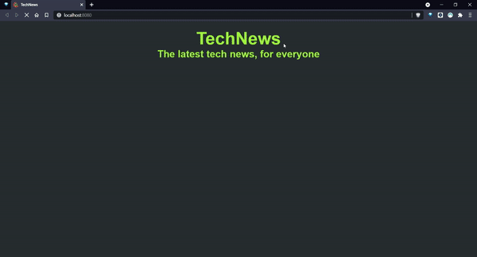

# TechNews

[DEMO](https://francescovicario.github.io/TechNews/)

Ho svolto questo progetto per certificare le competenze che ho ottenuto studiando la superguida JavaScript Advanced di Start2Impact.

All'apertura, il sito mostra le ultime 10 notizie postate su [Hacker News](https://news.ycombinator.com/), ottenute tramite una chiamata alla [api del sito](https://github.com/HackerNews/API). Per ogni news viene mostrato il titolo, con annesso il link della notizia (se cliccata, viene aperta in una nuova scheda), l'autore della notizia (con link che porta alla sua pagina su hacker news) e la data e ora della notizia.

A fine pagina è presente un pulsante che, se cliccato, carica le successive 10 news.

## Dettagli tecnici

Per creare il progetto ho utilizzato i seguenti linguaggi:

- HTML;
- CSS;
- JavaScript;
- Webpack.

All'avvio, viene attivata la funzione `LatestNewsCall`, che chiama la prima api: i dati (un array contenente gli id delle ultime 500 notizie postate sul sito) vengono salvati nella variabile `NewsID`.

Successivamente, viene attivata la funzione `newsRender`: per 10 volte, tramite un ciclo `for` che ha come punto di partenza il valore della variabile `newsCounter` e come punto di arrivo `newsCounter + 10`, vengono aggiunti gli id (nella posizione all'interno di `NewsID` data dal valore di `i`) nell'array `storiesArray`.

Dopo di che, tramite l'utilizzo di `Promise.all(storiesArray.map)`, che permette di rispettare l'ordine degli elementi nell'array, viene effettuata la chiamata alla seconda api del progetto. In entrambe le chiamate, se si riscontra un errore viene lanciato un `HttpError` con messaggio 'Data are currently unavailable.'.

I dati in risposta, oggetti contenenti le specifiche delle varie notizie, sono processati dentro `Promise.all(specifics.map)`: i dati utilizzati - titolo dell'articolo, autore, link e data e ora (forniti in Unix e convertiti in formato americano all'interno di `Promise`) - vengono renderizzati nella pagina all'interno di un div (`wrapperDiv`) con `innerHTML`. In caso di errore nella conversione viene lanciato un `InternalError`, che ha come messaggio un semplice 'Something went wrong.'.

Conclusa la chiamata, la funzione - attraverso `classList.remove` - toglie a `button` la classe `hidden` (che serve unicamente a nasconderlo in caso nella pagina non siano ancora stati caricati gli articoli o in caso di errore), svuota l'array `storiesArray` e aggiunge 10 alla variabile `newsCounter`, in modo che ogni volta che parte `newsRender` vengano usati sempre nuovi id.

Il `button` ha un `addEventListener` che, ad ogni click, fa partire `newsRender`.

Nel caso ci fosse un errore, la funzione `errorHandler` viene attivata: viene aggiunta `hidden` a `button` (attraverso `classList.add`) e vengono inseriti nel div due paragrafi: il primo ha come testo l'errore occorso, il secondo invece contiene un messaggio che invita a ricaricare la pagina o a riprovare più tardi.

Visto che le news sono in lingua inglese, ho preferito fare il sito completamente in questa lingua.
